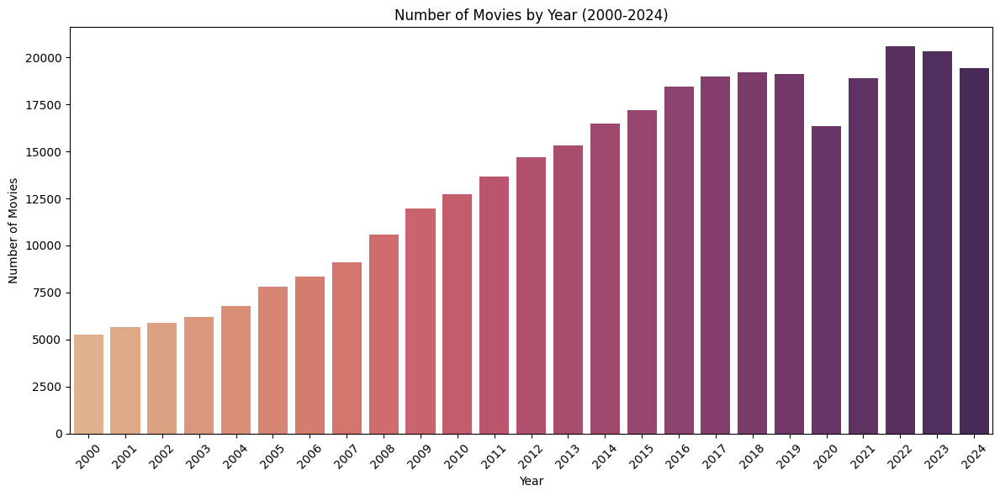
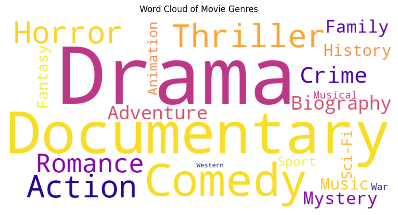
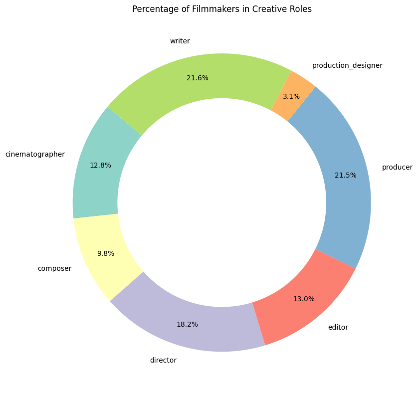

# 🎬 IMDb Movie Data Acquisition and Cleaning

Large-scale digital-trace data can reveal powerful insights into human behavior, but only if we first transform raw data into a structured, analysis-ready format. In this project, I developed a complete pipeline for acquiring, cleaning, and integrating data from the Internet Movie Database (IMDb)—the largest repository of film and filmmaker records spanning from 1900 to the present. IMDb is widely used by audiences to explore movie information, and by industry professionals to make strategic decisions related to hiring, investment, and market analysis.

**Key Skills:** Automated Data Acquisition, Data Cleaning & Transformation, Data Integration, Exploratory Data Analysis, Data Visualization

## 🚀 Project Overview

- **Acquiring**: Automatically downloading data directly from IMDb’s servers, ensuring we always work with the most current records.
- **Integrating**: Merging multiple IMDb datasets—including movie details, ratings, and crew information—into a single comprehensive dataset.
- **Cleaning & Transformation**: Handling missing values, duplicates, inconsistent formats, and converting data types to create structured, analysis-ready datasets.
- **Exploratory Analysis**: Conducting statistical summaries and visualizations to uncover trends in movie production, genre popularity, and creative team composition.

## 📚 Data Sources

- **IMDb Title Basics:** Contains movie IDs (`tconst`), title types, release years, genres, and runtime.
- **IMDb Title Ratings:** Provides ratings and vote counts for films.
- **IMDb Title Principals:** Lists film crew members, including their IDs (`nconst`), roles, and the movies they have worked on.

## 📊 Key Results

- **Movie Dataset:** Over 300,000 movies from 2000 to 2024, with detailed metadata (titles, genres, release years, ratings, etc.).
- **Filmmaker Dataset:** Over 600,000 creative professionals, including their names, roles, birth years, and filmography data.

These datasets serve as the foundation for my PhD dissertation, where I conducted dynamic network analysis and predictive modeling to understanding the key drivers of film and filmmaker success.

##  🖼️ Visualizations 

Below are sample visualizations that highlight key trends in the movie industry from 2000 to 2024:







## 💡 Applications of this Work

The methods demonstrated here have broad applications beyond the film industry:
- **Strategic Decision-Making:** Organizations can leverage similar data acquisition and cleaning pipelines to consolidate and analyze large datasets for informed decision-making.
- **Market Analysis:** Use detailed metadata to uncover trends, forecast market dynamics, or assess consumer behavior.
- **Human Resources:** Apply these techniques to analyze employee performance data, support talent management, and improve organizational efficiency.
- **Public Policy:** Researchers and policymakers can use similar methodologies to analyze large-scale datasets, informing policies related to cultural trends, media consumption, or labor markets.

## 💻 How to Use This Repository

1. Clone the Repository:  
   ```bash
   git clone https://github.com/nhunguyen0901/imdb-data-acquisition-cleaning.git
   cd imdb-data-acquisition-cleaning

2. Install Dependencies:
Ensure Python is installed, and then set up the required libraries using:
    ```bash
    pip install -r requirements.txt

3. Run the Notebook:
Open the Jupyter Notebook file (`IMDb_Data_Acquisition_Cleaning.ipynb`) using Jupyter Notebook or JupyterLab. Follow the cells sequentially to reproduce the results.


